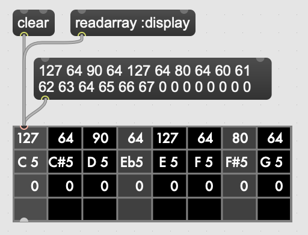

Features and Usage  
====================================================================================================

In this chapter I will discuss some of the principal features of s4m from the perspective of a composer-programmer
using s4m to create musical works. 
In the interest of space, I will not cover all of S4M's functionality, however the interested
reader can consult the online documentation in which all the capabilities are covered.
(https://iainctduncan.github.io/scheme-for-max-docs/)

This chapter assumes some familiarity with the Max platform, though readers unfamiliar with Max should be able to follow along.
Where I refer to a message sent to the s4m object, I am referring to a Max message, such as would occur
when a message object is connected to an inlet of the s4m object and clicked or "banged". 

Installation
-------------
Scheme for Max is released as a Max Package which contains: the s4m and s4m.grid Max externals;
a collection of Scheme source files; a Max help patch demonstrating features and use;
and some example patches and Max for Live devices using S4M.
In order to use S4M, the Max user must download the package file and uncompress it in their Max 
Packages directory, after which it will be possible to create an **s4m** object in a Max patch
and to open the s4m help patch for assistance.

Object Initialization
----------------------

Bootstrap files
^^^^^^^^^^^^^^^
When the s4m object is created in a Max patch, it will initialize itself by loading the bootstrap file, **s4m.scm**.
This file contains Scheme code on which the documented s4m functionality depends, and also loads several other Scheme dependencies.
This bootstrap file is available for inspection and alteration by the user, and it is expected that advanced users will 
alter their bootstrap file, allowing them to automatically load additional files that they would like to have available by default. 

The bootstrap file additionally loads the file **s74.scm**, which contains Scheme definitions that are not specific to Max.
s74 is intended to be an extension to s7 to provide convenience functions that a typical user will want available. 
It adds various higher-level functions taken from, or inspired by, less minimal Scheme implementations, such as Chez and Chicken,
as well as from the related Lisp dialects of Clojure, Racket, and Common Lisp.

The bootstrap file also loads several files that are packaged with s7 itself but are optional: **stuff.scm**, **loop.scm**, 
and **utilities.scm**.
These files come as optional extensions in s7 itself, and define several macros borrowed from Common Lisp 
and used in Common Music, such as **loop**, **dolist**, and **dotimes**.  

Once the s4m object has loaded s4m.scm and its subsequent dependencies, it is ready to be used.

Source Files
^^^^^^^^^^^^^
The user can load source files into the s4m object in several ways.
The primary way is to provide a file name as the first argument in the s4m object box in Max, similar to how this done
in many other Max objects that load files, such as the js and buffer objects.
S4M will search the Max file paths (user configured paths for source code search) to find the named file, and will load it if found.
This file is then considered the main file for the s4m object instance.
Double clicking the s4m box will print the full path to the main file in the console as a convenience to users.

Sending the s4m object the **reset** message will re-initialize the object, recreating the s7 interpreter and reloading 
the bootstrap files and the main file. 
Sending s4m a **reload** message will reload the main file, *without* resetting the interpreter.
The difference here is that if one has made definitions in the interpreter from outside the main file (how this happens will 
be covered shortly), these will not be erased on a reload, but will be on a reset.

Sending s4m a **source some-file.scm** message will load some-file.scm and set it as the main source file.
This can be useful in cases, such as in a Max for Live device, where it may be convenient not to have to edit the Max patch
to change the main file.
This use case is not uncommon as the commercial licenses required to *use* Max for Live and to *edit* in Max for Live are different. 
For example, one might create a device where a text box can be updated and is interpolated into a **source** message,
allowing a user of the device, who may not have the ability to edit devices, to change the main file. 

The message **read some-file.scm** will load a file (again searching on the Max file path) without resetting the interpreter or 
changing the s4m main file.
This is useful when working on a program or piece while it runs: a user can put state variables and score data in one file 
and algorithms in another, allowing them to reload the algorithms file after changing it, while leaving the state and score data alone.

In the event that the user has multiple similarly-named files on their Max search path, Max will load the first one it finds,
and print a message to the Max console indicating that multiple source files were found and which one it loaded. 
(This is a feature of Max, and has nothing to do with s4m specifically - it comes with the use of the SDK functions to 
load files from the search path.)

Inlets and Outlets
^^^^^^^^^^^^^^^^^^
By default, the s4m object will be created with one inlet and one outlet. 
The **@ins** and **@outs** attribute arguments can be used at instantiation time to create additional inlets and outlets,
to a maximum of thirty-two outlets.
While these are implemented as Max *attributes*, they cannot be changed in the Max object inspector as their number must be set
before object initialization. They can only be set as **@** arguments in the object box.

Input
--------------------------------------------------------------------------------

Inlet 0 Scheme Expressions
^^^^^^^^^^^^^^^^^^^^^^^^^^
Input to the s4m object works differently depending on whether one uses the main left-most inlet (a.k.a. inlet 0) or subsequent inlets. 
A common pattern in Max objects is for objects to accept "meta" messages in inlet 0 - messages that configure the object,
but are not calls to execute the object's main functionality.
S4M follows this pattern, and supports a number of meta messages, such as the previously mentioned **reset** and **source** messages.
While these message have an effect on the Scheme interpreter, they are handled by the s4m object's C functions,
rather than being passed to the Scheme interpreter for evaluation. 
I refer to messages that are handled this way as *reserved messages*, as they are not meant to be used
as function names in Scheme (technically, there is nothing preventing this, but it is not recommended 
as it will not be obvious how a message is being handled).

Any messages to inlet 0 that are not reserved messages are evaluated as expressions by the Scheme interpreter.
S4M adds implicit enclosing parentheses around any non-reserved messages that do not already start
and end with parentheses, and then passes the message to the s7 interpreter for evaluation.
This convenience feature allows users to make calls from Max messages to Scheme more visually readable - for example, 
a message of **my-fun 99** will be treated as **(my-fun 99)**. This also make it possible for users
to programmatically build Scheme expressions with Max objects, such as by using the **prepend** object to insert
a symbol at the beginning of some list. 
The return value from evaluation is normally printed to the Max console, though S4M provides various facilities for controlling
how much is printed to the console (see the documentation).

This facility makes it very straightforward for users to add input mechanisms to their programs. 
For example, if they want a number box to update a Scheme variable, they can use Max's dollar sign interpolation facility
in a message such as **set! my-var $1**, connecting a number box or dial to this message, and connecting the message box to inlet 0
of the s4m object.
Typing the number 99 into the number box will now result in Scheme calls to set the my-var variable to 99, as the s4m object
will receive the message **set! my-var 99** and will treat this as **(set! my-var 99)**, evaluating accordingly.
This capability significantly reduces the amount of code the user must write to make interactive patches when compared to the Max js object, 
as the js object requires explicit handler methods to be made for any input (Cycling 74 n.d.).

.. FIGURE 2 max message to scheme

.. figure:: figure_2_setting_variables_max_patch.png
   :class: with-border

   Figure 2: Setting Scheme variables using Max message interpolation.

A result of this input facility is that when one uses a symbol in a Max message sent to inlet 0, the interpreter will take the symbol
to be a variable name in the running Scheme program's top-level environment. 
Should the user wish to pass in a *symbol* (i.e., not refer to a variable), they can use the standard Scheme leading single 
quotation mark to quote the symbol.
They can also use an s7 *keyword* (a symbol beginning with a colon, that always evaluates to itself), in which case evaluation 
does not change the fact that the keyword is a symbol.
Rather fortunately for us, Max does not assign any special meaning to either single quotation marks or colons.
One can, for example, even name various Max objects such as buffers with colon-prefixed names.

For the majority of use cases, this is the easiest way to send input to the Scheme interpreter.
When one wants to do something with an argument from Max, one can use message interpolation or the **prepend** object 
to turn the incoming argument into a Scheme expression, and have the interpreter evaluate it.

There do exist, however, several convenience functions in case users want to handle input with even less boilerplate in their Max patch,
at the cost of more boilerplate on the Scheme side.
The **f-int**, **f-float**, **f-bang**, and **f-list** handlers are automatically invoked when the s4m object receives an
integer, float, bang, or list respectively in inlet 0.
If the user has defined such a function, it will be invoked, if they have not, the default handlers will be invoked, which
simply print an error message.
(These are named **f-int**, **f-float**, etc. to avoid the inconsistency that would result had we used **int**, **float**, and **bang**, 
as **list** is a built in Scheme function.)

Inlet 1+ 
^^^^^^^^
There are times when it is not desirable that the incoming symbols in Max messages be taken as Scheme variable names.
An example of this is dealing with incoming Open Sound Control (OSC) messages, where one may not have control over 
the text of the incoming message,
and thus inserting single quotation marks to indicate symbols is not possible.
For this reason, messages to inlets over 0 are not automatically evaluated as Scheme code.
This means that in order to accept input in inlets over 0, one must create a handler function and register it with 
Scheme for Max using the **listen** function. 
The call to **listen** takes arguments for the inlet number, the type of incoming
message, and the handler function, where the type of incoming message can be one of: integer, float, symbol, or list.
The handler function must be a single-arity function as it always receives its arguments as a single bundled list.
This allows handlers to be generic and also allows the same handler to be registered for multiple types of message.
An incoming Max list message made of Max symbols will be treated as a list of incoming quoted symbols.
(Experienced Lisp programmers can think of these as being automatically quoted arguments.)
It is up the handler to unpack the arguments from the list passed in.

Below is an example of defining a listener for a message consisting of an integer, and 
a second for a list.

.. code:: Scheme

  ;; handler message, all arguments are bundled into the args variable
  (define (my-int-handler args)
    (let ((int-arg (args 0)))
      (post "s4m got the int:" int-arg)))

  ;; register it to listen for integers on inlet 1
  (listen 1 :int my-int-handler)

  (define (my-list-func args)
    (let ((list-length (length args))
          (first-arg   (args 0)))
      (post "s4m received a" list-length "item list, first item:" first-arg)))

  ;; register it to listen for lists on inlet 1
  (listen 1 :list my-list-handler)

Output
--------------------------------------------------------------------------------
The s4m object can output a Max message from any of its outlets using the **out** function.
This is accomplished by passing the **out** function an outlet number and either a single value or a Scheme
list of output values. 
Output values must be either integers, floats, symbols, or strings. 
Other value types (such as hash-tables or nested lists) will produce an error.
Code to output various messages from outlet 0 is shown below.

.. code:: Scheme

  ;; output number 99
  (out 0 99)
  ;; output a max list of ints
  (out 0 (list 1 2 3))
  (out 0 '(1 2 3))
  ;; output a bang
  (out 0 'bang)
  ;; output the value of my-var
  (out 0 my-var)
  ;; output the max symbol "set"
  (out 0 'set)
  ;; output the max message "set 99"
  (out 0 (list 'set 99))

Note that in Max, the special message type "bang", such as one gets by clicking on a bang object,
is synonymous with a message of a single symbol atom consisting of the symbol "bang".

Sending Messages
--------------------------------------------------------------------------------
In addition to outputting messages via Max patch cables through the s4m object's outlets, 
the s4m object can also send messages directly to Max objects that have been given a Max **scripting name**. 
On instantiation, and additionally on receipt of a **scan** message, s4m objects
iterate over all objects in the same patcher and recursively through
any descendent patchers. On finding any object with a scripting name, a reference
to the object is placed in a registry in the s4m object, implemented as a Scheme hash-table
with scripting names as keys and object references as values.
The **send** function can then be used to directly send messages to these objects by using
a symbol argument similarly named. 
Attempting to send to an unrecognized object will produce an error. 

This uses the message sending functionality in the Max SDK, and is functionally no different 
from sending a message to a destination object via a patch cable. 
As with regular patch-cable messages, execution will pass to the receiving object and 
will not return to the caller until all subsequent processing in the receiving object has finished.
A variant of send exists, **send***, which flattens all arguments to allow conveniently
sending list messages.

Code to send messages to a named destination is shown below:

.. code:: Scheme

  ;; update the contents of a number box that has scripting name "num-target"
  ;; by sending it a numeric message
  ;; we quote num-target below as we want the symbol num-target, not the
  ;; value of a variable named num-target.
  (send 'num-target 99)
  
  ;; send a message box a message to update to the contents to "foobar 1 2 3"
  (send 'msg-target 'set 'foobar 1 2 3)
  
  ;; or if we had the list ('foobar 1 2 3) in a variable named "msg":
  (define msg '(foobar 1 2 3))
  (send* 'msg-target 'set msg)
  
This facility allows one to orchestrate complex activity in a Max patch without
having predetermined connection paths. The results of messages sent this way (as
with patch-cable messages) are determined entirely by the receiver.

Buffers & Tables
--------------------------------------------------------------------------------
Max contains two types of globally-accessible objects for storing arrays of numerical data: the **buffer** 
and the **table**. Buffers are typically used to store floating-point sample
data while tables are typically used to store integers, but either can be used for either. 
Both provide the programmer the ability to use indexed collections, and can have names,
allowing objects that are not connected to a given buffer or table object
to interact with them. The main use for buffers is as a container
for audio data that can be played back in various ways, as well as 
manipulated programmatically by reading from and writing to them. 
An interesting feature of buffers is that the abstraction of the buffer
of samples can be accessed by multiple Max objects by referring to the
buffer by name, the name being provided as an argument to the **buffer**
object that instantiates the buffer. This allows many objects to access
the same audio sample.

Scheme for Max provides a collection of functions for reading and writing
to and from buffers and tables, as well as convenience functions for 
getting the length of table or buffer and verifying if there exists
a particular named buffer or table (**buffer?**, and **buffer-samples**,
**table?**, **table-length**). 

The simplest way of using these is to read or write a single data
point using **buffer-ref** and **buffer-set!**. 
However, in the case of buffers, at the C level, Max locks the buffer before a read
or write operation to ensure thread-safety in case other objects (that
may be running in other threads) attempt to access the same buffer.
Similarly, Max provides an ability to **notify** on a buffer update,
so that objects sharing the buffer (such as visual display objects) 
can update their displays accordingly.
Consequently, interacting with a collection of samples from the same 
buffer with a Scheme loop that makes repeat
calls to buffer-ref or buffer-set! is slower than necessary,
as locking, unlocking, and notifying will happen on every loop iteration.
For these scenarios, s4m functions exist to copy blocks of samples between
Scheme vectors (Scheme's basic array type) and buffers, in
which optional starting index points and sample counts are provided as arguments.
At the C level, these lock, unlock, and notify only once, running
direct low-level memory copies for all samples in between locking and unlocking.

.. code:: Scheme
    
    ;; example buffer operations
    ;; return true if buffer-1 is a buffer
    (buffer? 'buffer-1)

    ;; get number of samples in buffer
    (buffer-size 'buffer-1)

    ;; read value at index 2
    (buffer-ref 'buffer-1 2)

    ;; write 0.5 to index 3 
    (buffer-set! 'buffer-1 3 99) 

    ; make a vector 
    (define my-vector (vector 0.125 0.25 0.375 0.5))
    
    ;copy vector into buffer in one operation
    (buffer-set-from-vector! 'buffer-1 0 my-vector)

While buffers (and to a lesser degree, tables) are implemented around the primary use case
of storing sample data, they can in fact be used for storing numerical
data in arrays for any purpose. The s4m facilities thus provide a complement to the
Max functions, enabling iterative array manipulation with more convenient
looping constructs than are built into Max.

Dictionaries
--------------------------------------------------------------------------------
Another higher-order data abstraction provided by Max is the
**dictionary**, a key-value store in which one can store a variety
of Max data types as values, and use integers, floats, symbols, or strings 
as keys. Max provides a rich API for working with dictionaries, including
the ability to refer to them by name across many objects, serialize them
to JSON, update them from JSON files, and even send references to them
between objects. There are a number of Max objects that have the ability
to dump their contents to dictionaries, and various display handlers. 

The Scheme equivalent of a dictionary is the **hash-table**, a key-value
store that can hold any valid Scheme object, either as a key or value.
S4M provides functions to interact with Max dictionaries and to
convert between Max dictionaries and Scheme hash-tables. 
Notably, these are recursively implemented: converting a Max
dictionary to a Scheme hash-table will convert all values in the 
dictionary, including nested dictionaries, regardless of the depth of nesting.
Interestingly, Max supports numerically indexed arrays of heterogenous type as values in dictionaries,
even though there is no convenient way of directly working with arrays of heterogenous types 
in the visual patcher (though one can in JavaScript using JavaScript arrays or objects).
Thus, using a dictionary as a container is one way to have simple arrays in regular
Max. If these are encountered during the conversion from 
a Max dictionary to a Scheme hash-table (or vice versa), S4M converts the nested arrays
to Scheme vectors, where these vectors may contain a mix of types,
including further nested dictionaries and arrays.

Similar to Common Lisp and Clojure, s7 Scheme (but not all Schemes) provides
a **keyword** data-type, which is a symbol that starts with a colon, and that
always evaluates to itself. These are commonly used as keys in
hash-tables. This is a convenient practice in Max, as one does not have to worry about
quoting or unquoting as data passes through evaluation boundaries, such
as when messages from Max go through inlet 0 of an s4m object.

S4M provides the functions **dict-ref**, **dict-set!**, 
**dict->hash-table**, **hash-table->dict**, and **dict-replace**
for working with dictionaries.
Of note is that these provide some convenience capabilities
for getting and setting values in nested dictionaries without having to nest
calls to dict-ref and dict-set!, as shown below.

.. code:: Scheme

  ;; get a value from max dict named "test-dict", at key "a"
  (dict-ref 'test-dict 'a)

  ;; get value at key "ba" in nested dict at key "b"
  (dict-ref 'test-dict (list 'b 'ba) )

  ;; get the value at index 2 in the nested vector at key "c"
  (dict-ref 'test-dict '(c 2) )

  ;; set a value in max dict named "test-dict", at key "z"
  (dict-set! 'test-dict 'z 44)

  ;; set a value that is a hash-table, becomes a nested dict
  (dict-set! 'test-dict 'y (hash-table :a 1 :b 2))

  ;; set value at key "bc" in nested dict at key "b"
  (dict-set! 'test-dict (list 'b 'bc) 111)

  ;; set a value that is a hash-table, creating an intermediate hash-table automatically
  (dict-replace! 'test-dict (list 'foo 'bar) 99)

  ;; create a hash-table from a named Max dictionary
  (define my-hash (dict->hash-table 'my-max-dict-name))

  ;; update a Max dict from a hash-table
  ;; if the Max dictionary does not exist, it will be created
  (hash-table->dict (hash-table :a 1 :b 2) 'my-max-dict-name)

S4M Arrays
--------------------------------------------------------------------------------
While in Max one has access to arrays of heterogenous type through dictionaries,
and homogenously typed arrays of integers and floats through buffers and tables, there is
no direct equivalent of the simple statically sized and homogenously typed C array
(that is to say, buffers and tables are much more complex, coming with various forms of overhead).
Scheme for Max fills this gap by providing its own internal implementation of arrays,
the **s4m-array**, which provides an interface to static C arrays.
These are created with the **make-array** function, providing a name,
size, and type, where type may be **:int**, **:float**, **:char**, or **:string**.
These arrays are stored by name in a global registry in the Scheme for Max
code, allowing multiple s4m objects to use them to share data between instances.
As the arrays are created in the s4m global registry, these persist beyond
the life of a single s4m object, and are, at this point, only freed upon a restart of Max.

S4M provides functions for working with these point-by-point,
(**array-ref** and **array-set!**) as well functions for copying
blocks of data to and from Scheme vectors (**array->vector**, **array-set-from-vector!**).

.. code:: Scheme
  
  ;; create a 128-point array of integers, naming with a keyword 
  (make-array my-array :int 128)

  ;; copy a value from one array to another
  (array-set! destination-array dest-index 
    (array-ref source-array source-index))

  ;; update a block of data from a Scheme vector
  (array-set-from-vector! display-array 0 #(0 1 2 3 5 6 7 8))  

Unlike Max buffers, s4m-arrays do not
include any thread protection. They are intended to be used in cases
where speed of access is the top priority, leaving synchronization issues
(and safety!) up to the programmer. 

The motivating use case for s4m-arrays is that of driving graphic displays
of tabular data as quickly as possible, such as
one would when making a visual display for a step sequencer.
In this scenario, one might have one s4m instance
that contains a sequencer engine which works with sequence data stored in vectors,
and a second instance, running in the low-priority thread off a timer, that drives
a graphic display showing this data.

In this scenario, we have an implementation of a **producer-consumer**
pattern: we know that only the sequencer will produce data, writing to the
s4m-array, and only the consumer will read the data. 
We also know that if the consumer should get partially updated data
(perhaps its thread runs part way through an update from the producer),
this is not a serious problem - some ripple in the display as data refreshes
is acceptable to the user as a cost for realtime performance.
Given our strict producer and consumer scheme, and our acceptance of ripple,
the s4m-array is preferable to using data structures such as buffer or table,
which will run more slowly on account of the thread-synchronization code
that they run. 

The s4m.grid object
--------------------------------------------------------------------------------
The missing piece for the scenario just discussed is a display element, 
and for this purpose Scheme for Max provides a graphical display object, the **s4m.grid**. 
The grid provides a visual grid on which we can draw values in each cell.
It is implemented as a Max UI object, built in the C SDK,
and has attributes that may be changed in the Max inspector window for
controlling spacing, font size, striping, conversion to MIDI note names,
vertical versus horizontal orientation, 
and whether a value of zero should be drawn or remain blank.

The grid can be updated in two ways. The first is to send it a Max list message.
On receipt of a list, the grid will update each cell from the list, iterating
either by rows then columns or vice versa, depending on the orientation attribute.
The second update method is to read directly from a named s4m-array, on 
receipt of the **readarray** message. 
In the second case, the grid iterates through the s4m-array using direct memory access
(again according to the orientation attribute), updating each cell. 
Updating from an s4m-array has the speed advantage that no Max atoms or
message data structures need to be created and then parsed for each item of data - the
numerical data are read directly from contiguous memory by the display
function.
When driving a large grid from a timer, this has a significant impact on the 
processing load created. The result of this is that it is practical to have
several large grids updating multiple times per second without creating
problematic loads.

The intended workflow is that the programmer will have
a component of their sequencing system acting as a view driver. 
This can be code that is run on a periodic timer (perhaps every 100 to 200 ms),
queries the desired Scheme structures (such as 
reading the sequence data vectors from a Scheme sequencer),
and writes the data which we want to view into an s4m-array, thus acting
as the producer half.
On a separate timer (or the same timer if desired), a
grid element running in the UI thread will be sent the display message with the name of this
array, acting as the consumer and triggering a redraw of the contents.

In this workflow, the s4m-array acts as a framebuffer,
a data structure that virtually represents a display element, and
the entire system acts as an immediate-mode GUI. 
An immediate-mode GUIs decouples the display from the data model,
making it possible for the display to accurate reflect the current
state of sequencing data, regardless of how it was set
- that is, the system makes no assumptions that the graphical
widget *displaying* data is also responsible for *updating* data.
This is desirable in an algorithmic music platform as one cannot
assume that the state of the sequencing data originates from
GUI actions - it could come from autonomous processes, network
requests, MIDI input, and the like. 
The disadvantage of an immediate mode GUI is the processing cost:
it is constantly running data queries and updates regardless of whether
data has changed. 
Thus, the low-level speed optimizations of the s4m.grid and s4m-array 
facilities make immediate-mode GUIs practical where previously they were not.
In my personal experiments, comparison with the Max built in jit.cellblock
(the built in tabular display element) showed very significant speed 
increases - from unusable with one 64 x 16 grid, to usable with 
four 64 x 16 grids with minimal CPU impact.

.. figure of the s4m-grid

   Figure 3: The s4m.grid display object.

Scheduling Functions 
--------------------------------------------------------------------------------

Arguably the most important features of Scheme for Max
are its scheduling and timing capabilities and their integration
with the Max threading and transport subsystems. 
On a surface level, they are quite straightforward: s4m provides
functions that allow one to schedule execution of a zero-arity Scheme
function at some point in the future. The simplest of these is the
**delay** function. 
In the example below, an anonymous function is created (in order to make
a zero-arity function) and put on the scheduler
to execute in 1000 milliseconds. The call to delay returns a
handle that can be used to cancel the scheduled function.

.. code:: Scheme
  
  ;; create a lambda function that prints to the console,
  ;; and schedule it for 1 second in the future, saving the handle
  (define my-handle
    (delay 1000 
      (lambda () (post "Hello from the future!"))))
  
  ;; cancel its execution
  (cancel-delay my-handle)

The delay function has variants that allow one to schedule
in ticks (based on the Max global transport, at 480 ticks per beat),
and in quantized ticks, where execution time is forced to align to a tick
boundary regardless of at what time the call to delay was made.
The quantized tick delay functions will thus only execute if the Max transport is
playing, making it possible to synchronize scheduled functions accurately
with other Max sequencing tools or with the Ableton Live built-in sequencers.

.. code:: Scheme
  
  ;; schedule my-function for 1 quarter note from now
  (delay-t 480 my-function)
  
  ;; schedule my-quantized-function for 1 quarter note from now, but forcing now 
  ;; to be interpreted as on the nearest 16th note boundary from the time
  ;; of the scheduling call, given a running transport
  (delay-tq 480 120 my-quantized-function)
  
At an implementation level, these use the Max SDK's **clock** functions, 
which allow one to precisely schedule
execution of a callback function. It is important to note that in 
modern versions of Max these functions are designed to preserve
long-term temporal accuracy regardless of immediate jitter.
Jitter, in this context, refers to the difference between the scheduled
time and the actual execution time as one would see if analyzing recorded audio.

For optimal real-time audio performance in Max, the recommended
settings are to have "audio in interrupt" and "overdrive" enabled. 
When both of these are turned on, the Max engine alternately runs
a DSP pass (calculating a signal vector of samples), and a scheduler
thread pass (Cycling 74 n.d.). 
This means that the actual onset time of events triggered from 
scheduler thread processes can be off by up to a signal
vector of samples, resulting in small timing discrepancies.
At a signal-vector size of 64 samples (the default for Ableton Live) and
a sample rate of 44100 samples per second, this is ~1.5 milliseconds,
and is thus a musically acceptable discrepancy. 
Note though that the clock functions
in current versions of Max compensate for this in the long run such
that this discrepancy does not accumulate. 
Tests I made during development confirmed that even after long
playback times, clock driven functions did not accumulate jitter,
and that if one sets the Max signal vector size to 1 sample, 
the timing on the clock functions is sample accurate (at the
cost of much higher CPU use).

The Scheme for Max functions use these clock facilities by putting
a reference to the Scheme callback function (the function passed to the delay function)
into a special internal registry, keyed by their handles. 
When the C clock callback runs, the stored handle is retrieved 
and used to retrieve the Scheme callback, which is then executed. 

There is a powerful but not immediately obvious capability granted by 
the combination of this facility 
and the nature of Scheme's lexical scoping. This is that
Scheme for Max makes it possible to easily specify whether
a scheduled function should use values taken
from the environment at the time of scheduling, 
or at the time of execution for which it is scheduled. 
This is not possible in regular Max patching, and while it is technically
possible using JavaScript, it is of limited practical use given the
problematic levels of jitter one may have when using the js object.
(As previously discussed, this is because it is always executing in the low-priority thread.)

This facility makes musical algorithms and real-time interaction possible in
interesting ways. For example, one might create a patch in which
dials or hardware change some musical value. This value can be captured
at scheduling time, such that when the function executes in the future,
the value *where the dial was* is used. Alternatively, one can
use a function that explicitly looks in the global environment 
for settings at run time of *where the dial is now*.

Below is an example of a function that uses both of these facilities.
The value read from **dial-1** will be used as it was at scheduling
time, while the value from **dial-2** will be looked up in the future.

.. TODO check and verify this code

.. code:: Scheme
  
  ;; capture the value of g-dial-1 and use it in the function
  ;; look up the value of g-dial-2 in the future
  (delay-t 480 
    (let ((dial-1-capture g-dial-1))
      (lambda ()
        (let ((dial-2-now (eval 'dial-2)))
          (post "dial-1 was:" dial-1-capture)
          (post "dial-2 is:" dial-2-now)))))

In combination with s4m's capability of updating code interactively while
programs run, this scheduling flexibility enables the programmer-performer
to edit algorithms used in a performance in interesting ways, even once 
they have already been scheduled. 

Finally, these facilities enable a workflow known as
"self-scheduling" or "temporal recursion", 
in which a repeating function schedules the next pass of itself (Lazzarini 2016, 115-116). 
This enables the composer to create evolving
processes, as each pass of a function can change the data,
(or even the code!) of the next pass of the function. One might think 
at first glance that this would result in an accumulation of timing
jitter, but the implementation of Max clocks does indeed make this possible
while preserving temporal accuracy over long periods of time, something
I have tested extensively.

Below is an example of a function scheduling itself. The first iteration
of this function would be kicked off by a call to the **start** function,
and the temporal recursion will stop when the variable **playing** is set to false.

.. TODO: test this code

.. code:: Scheme

  ;; a variable to turn on and off playback
  (define playing #f)

  ;; a function that schedules itself to run on every quarter note
  ;; and keeps track of how many times it has run
  (define (my-process runs)
    (post "run number:" runs)
    (if playing
      (delay-t 480 
        ;; create an anonymous function that wraps the next call to my-process
        ;; this is necessary as we can only schedule zero-arity functions
        (lambda ()(my-process (+ 1 runs))))))

  ;; a function to start the process
  (define (start)
    (set! playing #t)
    ;; kick it off with the first call
    (my-process 0))

  ;; a function to stop the scheduling chain
  (define (stop)
    (set! playing #f))

The above can, of course, be combined with the previously mentioned
lexical scoping capabilities, enabling implementations of complex,
interactive, algorithmic process music in succinct and flexible code.
The Scheme for Max online documentation and example repositories contain
examples of interactive algorithmic sequencers implemented in this way.
      
Garbage collector functions 
--------------------------------------------------------------------------------
I have previously referred to the fact that, as a high-level, dynamically-typed language, Scheme includes a 
**garbage collector** (a.k.a. **gc**).
The garbage collector is a language subsystem that finds and
frees memory which has previously been allocated by the program but is no longer needed.
Garbage collection spares the programmer the tedious and error-prone work of manually allocating,
tracking, and freeing the memory used by variables in the language.
Garbage collection was first implemented in the Lisp-family of languages,
but is now a standard feature of almost all modern high-level programming languages,
including Java, C#, Python, Ruby, and JavaScript. 

The problem with garbage collection in soft-realtime
work (such as music, where missed deadlines are undesirable, but not catastrophic)
is that the gc must periodically do its work, in which it scans over the program
memory, looking for unused memory allocations and freeing them. 
This can be a computationally expensive process when the program is large or
uses large amounts of data, thus taking time and potentially leading to missed deadlines.
Further complicating things, garbage collection is of indeterminate duration,
as the work that the gc must do is heavily dependent on the particular algorithms
and data structures used in the program over which it is running
That is to say, a program of some given size and memory use may require more or less
garbage collection processing, depending on how precisely it is written. (Deutsch and Bobrow 1976, 522-523)

For these reasons, the use of garbage-collected languages is not common
in realtime audio programming, where the program must be doing constant calculations
to produce streams of samples. 
Scheme for Max, however, is intended to be used at the *note level*,
rather than the *audio level*, thus the typical time between blocks of computation
is potentially much higher (i.e., the temporal gap between notes rather than between blocks of samples),
giving us potentially adequate time for a garbage collector to run.
Modern audio workstations allow a user to configure the output audio buffer size,
corresponding to the number of samples the program pre-computes in one block, and thus
also corresponding to the latency of realtime operation.
This essentially provides the program with a buffer of time during which it can catch up 
on "bursty" work.
While the s7 garbage collector will cause issues if attempting to run
Scheme for Max programs in a host with very low output buffer and latency settings (e.g.,
64 samples or less), on a modern computer and moderately sized program,
the gc is able to run within the latency period of an output buffer of 128 samples
or more (depending on the program). This is sufficiently low for playable latency
in many situations.

Nonetheless, a heavy Scheme for Max program can run out of time for
the garbage collector, resulting in audio underruns and audible clicks.
For these cases, Scheme for Max provides some additional facilities
for controlling whether and when the gc runs.

The first of these, perhaps counterintuitively, allows one to control 
when the gc runs on a timer, allowing it to run *more* frequently
than is the case if one does not force a gc run. This increases
the overall work the gc does (as it runs more frequently), but lowers 
how much work it must do on each pass, allowing each pass to complete more quickly.

Sending the **gc-disable** message to the s4m object disables automatic
running of the gc, leaving one to explicitly force a run by sending
the **gc-run** message, which can be triggered off a timer such as a
Max metronome. In my experience, setting this to somewhere between
200 and 300 ms works well and provides better realtime performance
than is possible using the automatic gc, which may wait many seconds between runs.

A second facility is the ability to change the starting heap size of the Scheme for Max object.
The lower the heap size, the faster the gc runs, as it must run over less
memory. The s4m object accepts an initial
**@heap** attribute to set the starting heap size. This works well so 
long as one checks whether the heap allocated will be big enough.
If it is not, a *heap reallocation* will be required when s4m is out of memory,
which is likely to cause audio issues as this allocation takes some time. 
Users can use s7's built in gc reporting by turning on the **gc-stats** flag,
which will result in output to the console on each gc pass, including the
amount of memory it must run over. This can be used to ensure the initial
heap size is adequate by running some tests over a given piece or Scheme program
to determine the lowest feasible heap size.

Finally, if the performance of a piece is of a reasonable duration, the
user may elect to disable the garbage collector altogether.
This is done again by sending the **gc-disable** message, but this time without
following it by any forced gc runs. In this case, the heap will likely
need to be rather large, as the memory use of the program will grow as it
runs, with unused memory never getting freed. In programming parlance, 
this is referred to as a "memory leak", and is normally considered 
a bug. However, given that the size of audio sample libraries and personal computer RAM
is now commonly in the gigabytes, it is certainly
not unreasonable for one to pre-allocate a larger heap and let a program grow 
in memory on the order of megabytes.

Conclusion
-----------
This covers the main features and capabilities of Scheme for Max
in version 0.4.
Additional functions and variations on those discussed here are
covered in both the official online documentation and in the Max help file.  
Additionally, various tutorials with examples are available, and 
are linked from the main GitHub project page.

